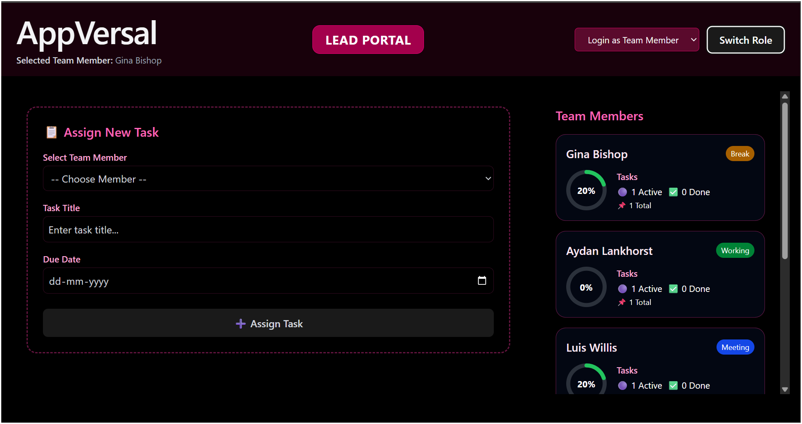
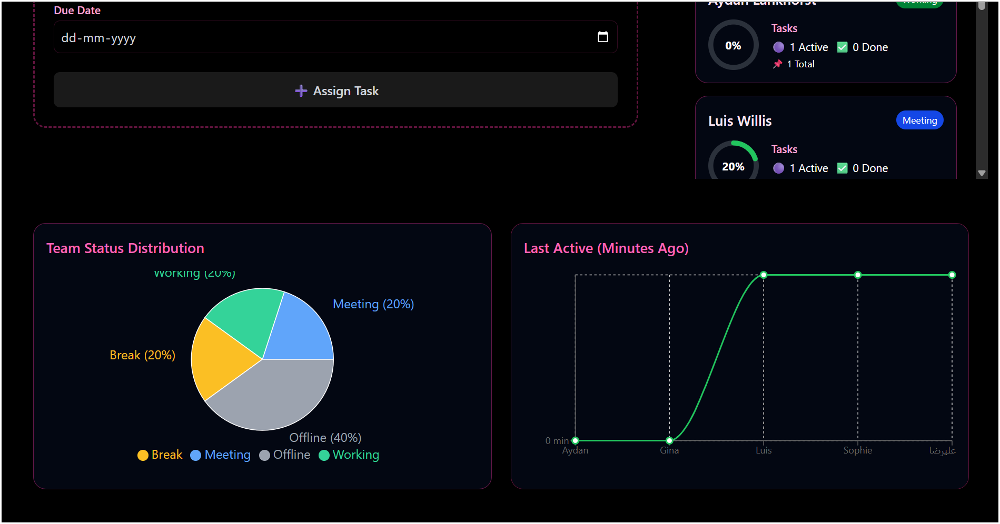
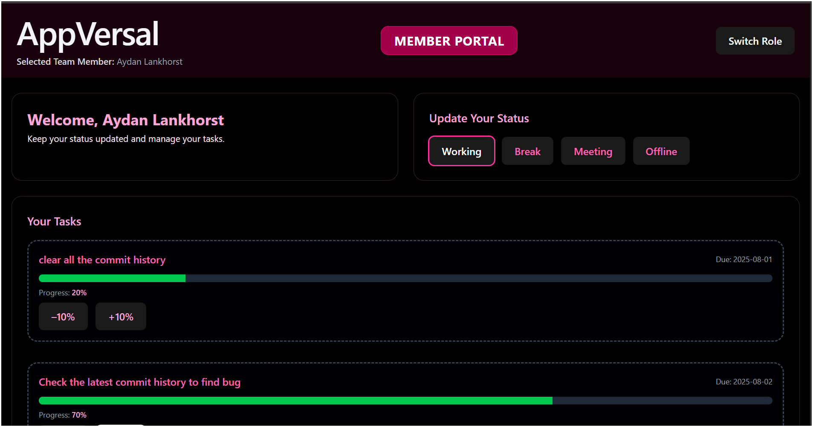

# 🖥️ Team Pulse Dashboard

A responsive and intuitive productivity monitoring dashboard for team leads and team members, built using **React**, **Redux Toolkit**, and **Tailwind CSS**. It allows real-time status updates, task assignment, progress tracking, and insightful visualization — all without a backend.

---

## 📌 Project Overview

The **Team Pulse Dashboard** is designed to simulate a real-time productivity monitoring tool for distributed teams. It features two distinct user roles:

- **Team Lead Portal**
  - View all team members with their status (Working, Break, Meeting, Offline)
  - Assign tasks with due dates
  - Monitor progress visually via task completion and pie charts
  - Sort members by last activity time

- **Team Member Portal**
  - Login and update your own work status
  - View assigned tasks and update progress (in 10% increments)
  - Automatically marks task complete at 100%

Initial member data is fetched from [`randomuser.me`](https://randomuser.me/), mimicking a live team structure.

---

## 🎯 Features
🔄 Auto-reset member status to “Offline” after 10 minutes of inactivity.

📊 Pie chart of current team status distribution.

🌗 Dark mode toggle with Tailwind.

⏱️ Sort members by lastActive.

🔐 Role switcher (Team Lead / Team Member).

🔍 Member filtering by status.

🧠 Smooth UI with modular components.


## 🚀 Tech Stack

| Layer        | Technology |
|--------------|------------|
| Frontend     | React + Vite |
| Styling      | Tailwind CSS |
| State Mgmt   | Redux Toolkit |
| Charting     | Recharts |
| Icons/Design | Lucide-react, shadcn/ui |
| Data Source  | [randomuser.me](https://randomuser.me/) API (mock data only) |

---

## 🛠️ Setup Instructions

### 1. Clone the repo
```bash
git clone https://github.com/your-username/team-pulse-dashboard.git
cd team-pulse-dashboard
```

### 2. Install dependencies
```bash
npm install
```

### 2. Run the project
```bash
npm run dev
```
Open http://localhost:5173 in your browser.

## 📷 Screenshots
### 🔵 Lead Portal




### 🟢 Member Portal
